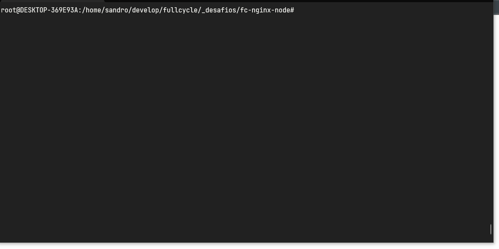

<!-- Please update value in the {}  -->

<h1 align="center">sandro-dev/fc-nginx-node</h1>

<div align="center">
   Solution for a challenge from FullCycle</a>
</div>

<!-- TABLE OF CONTENTS -->

## Table of Contents

- [Overview](#overview)
  - [Built With](#built-with)
  - [Folder Structure](#folder-structure)
- [How to use](#how-to-use)
- [Contact](#contact)

<!-- OVERVIEW -->

## Overview



The challenge is:

- [x] Nginx reverse proxy calls a nodeJS application
- [x] The nodeJS application waits for a MySQL database to be ready
- [x] After MySQL is ready, the nodeJS application is up and inserts an user on a table;
- [x] Render index page with "FullCycle" title and a list of user inserted

### Built With
- [Docker](https://www.docker.com)
- [NodeJS](https://nodejs.org/)
- [MySQL](https://www.mysql.com/)

### Folder Structure
```sh
.
├── .github/                   # assets for documentation
├── mysql/
│   ├── .env                  # environment variables
├── nginx/
│   ├── nginx.conf            # nginx configuration file
├── node/          
│   ├── src/         
│   │   ├── config/
          ├── db.config.json  # database config file                              
│   │   ├── views/            # ejs files for render a view
│   │   └── app.js            # the main file on application
│   │   └── routes.js         # routes of application
│   │   └── server.js         # file for listening server port
│   ├── Dockerfile            # dockerfile for nodejs 
│   ├── package.json          # libraries and scripts for the project
├── .gitgnore                 # control of versioning files
├── docker-compose            # the file responsible for create containers applications
└── README.md                 # documentaion for github.


```

## Environment variables
Variáveis de ambiente utilizadas pela aplicação:

| Name | Description | Default value |
| ---  | --- | --- | 
| PORT | exposed por for application | 4000 |
| MYSQL_DATABASE | MySQL database name | nodejs |
| MYSQL_USER | MySQL database user | sandro |
| MYSQL_PASSWORD | MySQL database password | 123456 |


## How To Use

To download and run this container application, you'll need the [Docker](https://www.docker.com/) (Docker Native or Docker Desktop). From your command line:

```bash
# Download the images and create containers application
$ docker compose up -d

# Verify if the containers were created
$ docker compose ps
```

## Contact

- GitHub [@sandro-dev](https://github.com/sandro-dev)
- LinkedIn [@sandro-dev](https://www.linkedin.com/in/sandro-dev/)